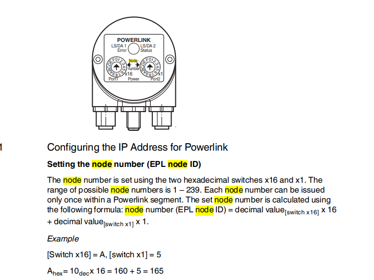

#Debug Safety

<div class="theme-moos" markdown="1">
???+ note "Note"
    Verifier les PLC Adresses : exemple : node 17 =  port1 1(16) + port2 1(1)
</div>



???+ Warning "Warning"
    Verfifier parametrage moteur => doc trucs et astuce

<div class="theme-moos" markdown="1">

```cpp

Verifier blocs ASI avec bonnes adresses individuellement
Verifier little endian ou big endian pour les elements en profinet (cameras, …), noms devices et adresses IP doivent etre correcte
Penser a vérifier aussi les NODE NUMBER DES CARTES !! Unlock tout au début

```
</div>